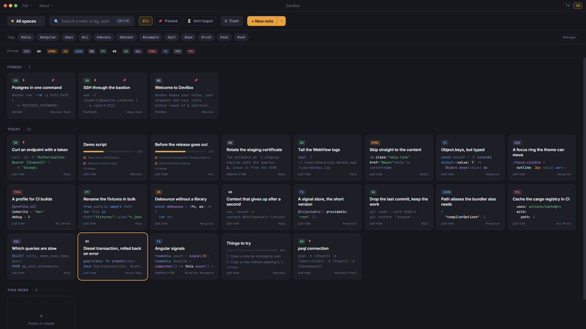
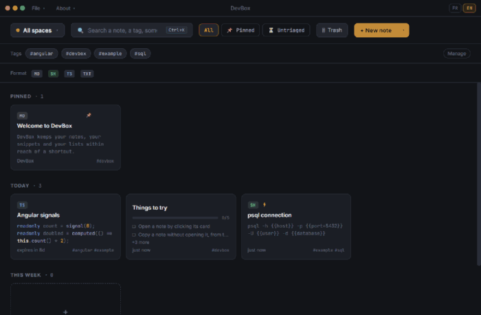

# DevBox

[](https://github.com/vmillet-dev/devbox-rs/actions/workflows/ci.yml)
[](https://github.com/vmillet-dev/devbox-rs/releases/latest)
[](LICENSE)

A notes and snippets manager for developers, on the desktop. Write a snippet once, find it
by tag or by full text, and paste it into any application from a global shortcut.



Search it, narrow it by tag, open it — and from any application, `Ctrl+Alt+P` brings up the
palette, where `Enter` copies and the window steps aside:



Everything stays on your machine, in a SQLite file you can copy. Nothing is uploaded, there
is no account, and the application works with the network off.

## What it does

| Feature              | What it gives you                                                                                 |
| -------------------- | ------------------------------------------------------------------------------------------------- |
| **Quick paste**      | `Ctrl+Alt+P` from any application: search a snippet, `Enter` copies it and the window steps aside |
| **`{{fields}}`**     | `psql -h {{host}} -p {{port=5432}}` asks for its values before landing in the clipboard           |
| **Keyboard canvas**  | arrows to move, `Enter` to open, `C` to copy, `P` to pin, `X` to select, `Del` to trash           |
| **Todo lists**       | a second kind of note: an ordered, tickable list instead of a body                                |
| **Trash**            | deleting is undoable, and reversible for 30 days                                                  |
| **Bulk actions**     | select several notes, then move, tag, export or trash them in one go                              |
| **Tag management**   | rename, merge or drop a tag across the whole library                                              |
| **Attachments**      | drop a file on the editor or paste an image; open it, save it elsewhere, preview it inline        |
| **Import / export**  | a JSON bundle both ways — everything, one space, or the selection — with a report either way      |
| **Copy as Markdown** | the selection rendered for a pull request, a ticket or a chat message                             |

Syntax highlighting covers eighteen languages, the interface is available in French and
English, and it ships with a light and a dark theme.

## Install

Download from the [latest release](https://github.com/vmillet-dev/devbox-rs/releases/latest).

**Windows**

| File                             | Pick it if                                                     |
| -------------------------------- | -------------------------------------------------------------- |
| `devbox_<version>_x64-setup.exe` | You just want DevBox installed. This is the one to take.       |
| `devbox_<version>_x64_en-US.msi` | You deploy software through group policy or a management tool. |
| `devbox-<version>-windows.exe`   | You want no installer at all — run it from where it lands.     |

**Linux**

| File                              | Pick it if                            |
| --------------------------------- | ------------------------------------- |
| `devbox_<version>_amd64.AppImage` | Any distribution, nothing to install. |
| `devbox_<version>_amd64.deb`      | Debian, Ubuntu and derivatives.       |
| `devbox-<version>-1.x86_64.rpm`   | Fedora, RHEL and derivatives.         |
| `devbox-<version>-linux`          | The bare executable, no packaging.    |

```bash
chmod +x devbox_*_amd64.AppImage        # make the AppImage runnable, then launch it
sudo apt install ./devbox_*_amd64.deb   # Debian and Ubuntu — pulls in what it needs
sudo dnf install ./devbox-*.x86_64.rpm  # Fedora and RHEL
```

On Windows, the installer and the MSI are opened by double-clicking them; the standalone
`.exe` needs nothing at all.

Updates are offered inside the application, so you only download by hand once.

Windows shows a SmartScreen warning the first time — choose **More info**, then **Run
anyway**. It is about the identity of the publisher, not about the file: DevBox has no
code-signing certificate, while its updates are signed with minisign and verified before
they install. Every release also publishes `SHA256SUMS.txt`.

## Build from source

You need Node.js 24 — the version `.nvmrc` pins, and what CI installs — Rust through `rustup`, and
[Tauri's system dependencies](https://tauri.app/start/prerequisites/) for your OS.

```bash
npm install
npm run tauri dev
```

Front-end changes hot-reload; Rust changes trigger a slower automatic recompile.
[CONTRIBUTING.md](CONTRIBUTING.md) has the rest: the full script list, what CI checks, and
the conventions that are load-bearing.

## Documentation

- [Contributing](CONTRIBUTING.md) — how to build and test, what CI checks, and the handful of
  conventions the compiler cannot enforce. Read it before your first change.
- [Architecture](docs/architecture.md) — front-end structure, state and data-access patterns,
  i18n, theming, the Angular ↔ Rust boundary, and testing conventions.
- [Releasing](docs/releasing.md) — how a version gets cut, and how release notes are sorted.
- [Changelog](CHANGELOG.md) — what changed, and when.
- [`docs/scratch-mockup-v2.html`](docs/scratch-mockup-v2.html) — the static UI mockup used as
  the visual reference. Not code to run or import.

## Built with

**Angular 22** on the front — standalone components, signals, zoneless change detection —
and **Rust with Tauri v2** as the native shell, persisting to an embedded SQLite database
through Diesel. The two halves are filed by subject rather than by technical nature, and the
IPC surface between them is generated from the Rust signatures.

## License

DevBox is free software under the [GNU General Public License v3.0](LICENSE). You may use,
study, share and modify it; a distributed fork has to stay under the same terms and ship its
source.

Contributions are accepted under that same license: opening a pull request means you agree to
have your work distributed under the GPL-3.0.
